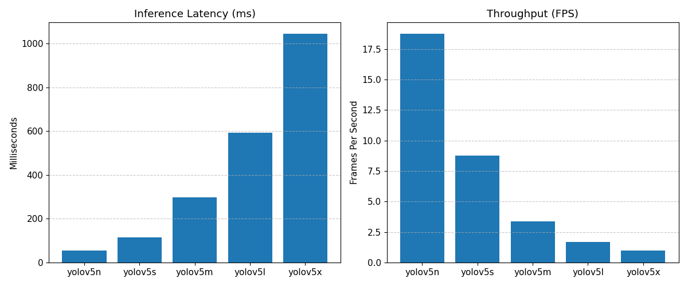
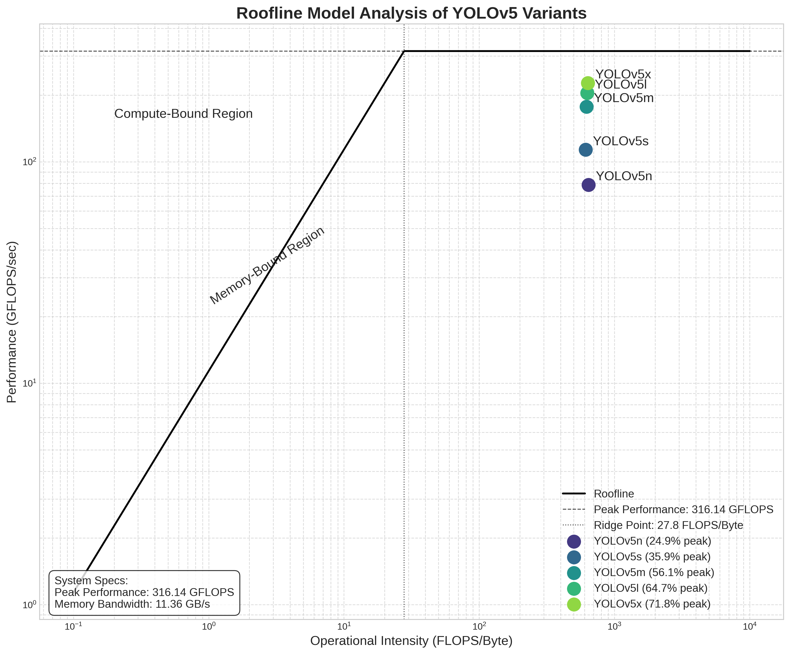
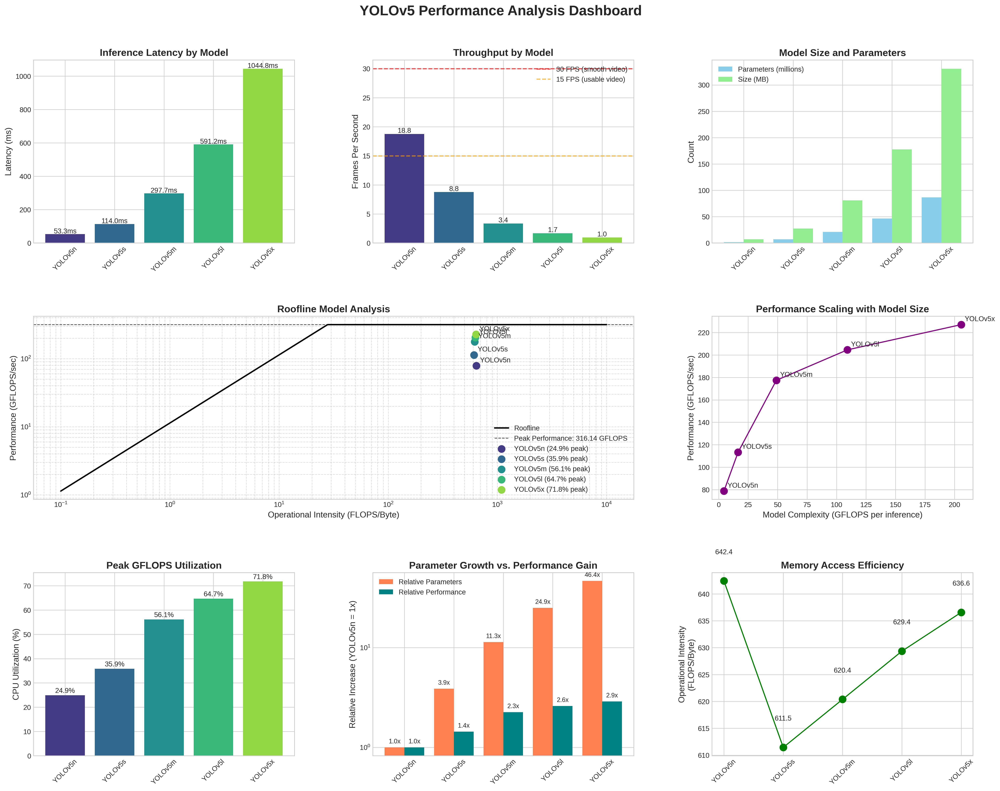
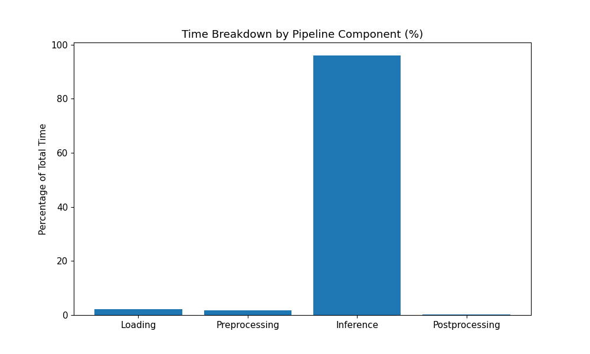
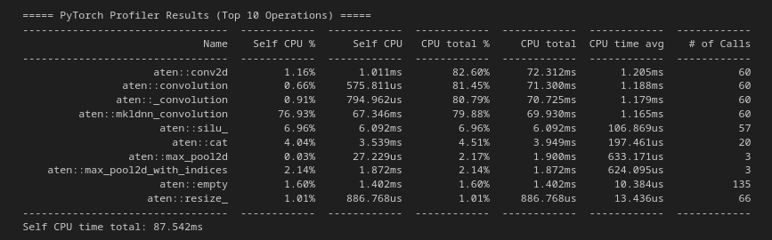
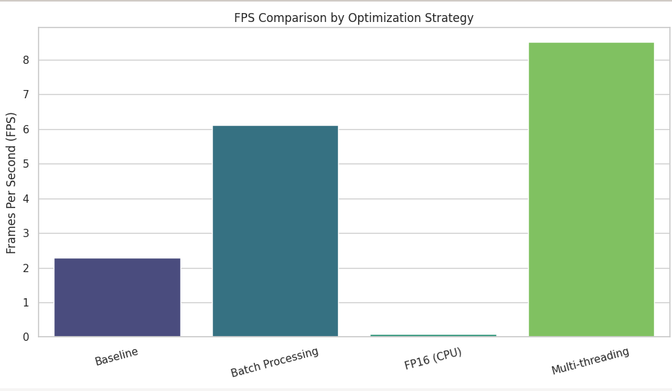
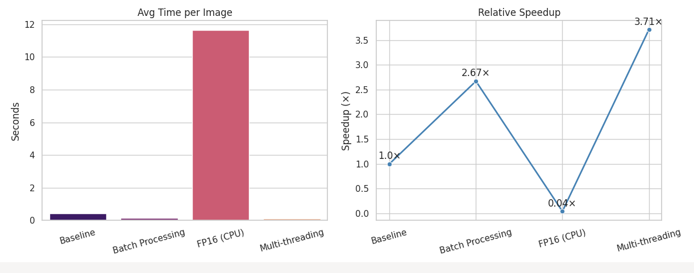
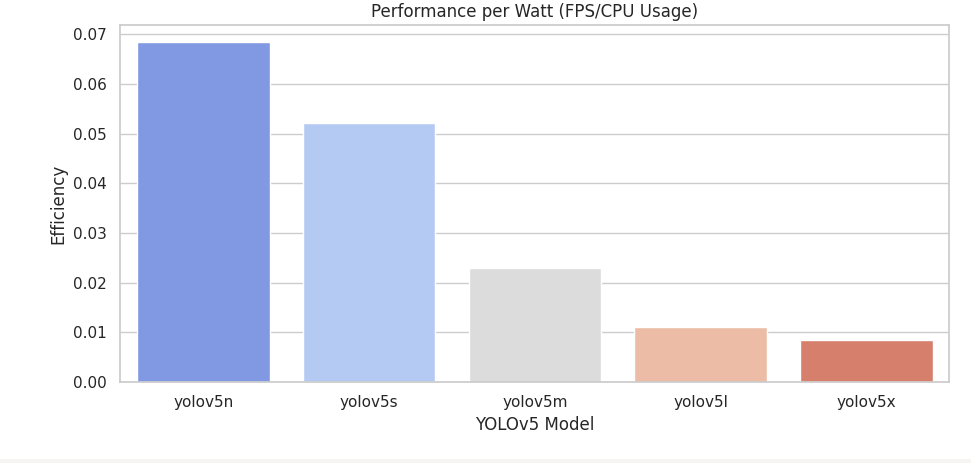

# SPP HW2: YOLOv5 Performance Analysis & Optimization
                                                            
**Name:** Ved Prakash Maurya  
**Roll No:** 2023101006
                                                            
## System Specs
- **CPU:** 12th Gen Intel i5-1235U (12) @ 4.400GHz
- **RAM:** 16GB
                                                            
## Dataset Used
[Link](#) (https://github.com/ultralytics/yolov5/releases/download/v1.0/coco128.zip)
                                                            
## Problem 1: YOLOv5 Benchmark Results

I benchmarked all five YOLOv5 model variants (nano, small, medium, large, and xlarge) on my system using 100 test images. The tests measured both inference latency (milliseconds per image) and throughput (frames per second).

### Benchmark Results

| Model   | Latency (ms) | Throughput (FPS) |
|---------|--------------|------------------|
| YOLOv5n | 53.27        | 18.77            |
| YOLOv5s | 113.95       | 8.78             |
| YOLOv5m | 297.69       | 3.36             |
| YOLOv5l | 591.16       | 1.69             |
| YOLOv5x | 1044.80      | 0.96             |

### Visualization

### Analysis

- **YOLOv5n** (nano): Offers the fastest inference speed with ~18.8 FPS, making it suitable for real-time applications where low latency is critical, though typically at the cost of lower accuracy.

- **YOLOv5s** (small): Provides a reasonable balance with ~8.8 FPS, suitable for applications that need higher accuracy than nano while maintaining decent speed.

- **YOLOv5m** (medium): With ~3.4 FPS, this model represents a middle ground between speed and accuracy. It may be suitable for applications where real-time processing isn't critical.

- **YOLOv5l** (large): At ~1.7 FPS, this model is significantly slower but offers better accuracy. Best for offline processing or applications where accuracy is more important than speed.

- **YOLOv5x** (xlarge): The most accurate but slowest model at ~0.96 FPS (just under 1 frame per second). Suitable only for applications where maximizing accuracy is paramount and processing time isn't a concern.

### Observations

- There is a clear trade-off between model size and speed - as models get larger and potentially more accurate, the inference time increases substantially.
- For real-time applications (typically requiring >10 FPS), only YOLOv5n would be suitable on my hardware.
- The difference between YOLOv5l and YOLOv5x is substantial in terms of latency (~1.8x slower), despite both being in the non-real-time range.

These benchmarks were conducted on CPU only. GPU acceleration would likely show different performance characteristics and potentially enable real-time processing with larger models.(My laptop does not have GPU)
                                                            
#  Problem 2: YOLOv5 Roofline Analysis

##  Hardware Characteristics

- **Estimated Peak Performance:** 316.14 GFLOPS  
- **Estimated Memory Bandwidth:** 11.36 GB/s  

These estimates are based on system profiling using theoretical peak CPU capabilities and benchmarking tools.

---

##  Model Specifications

| Model    | Parameters     | Model Size (MB) | GFLOPS per Inference |
|----------|----------------|------------------|-----------------------|
| YOLOv5n  | 1,867,405      | 7.17             | 4.50                  |
| YOLOv5s  | 7,225,885      | 27.61            | 16.49                 |
| YOLOv5m  | 21,172,173     | 80.82            | 48.97                 |
| YOLOv5l  | 46,533,693     | 177.59           | 109.15                |
| YOLOv5x  | 86,705,005     | 330.85           | 205.67                |

---

## 📈 Roofline Analysis Results

| Model    | GFLOPS/sec | Operational Intensity (FLOPS/Byte) | Bound Type     | Peak GFLOPS Utilization (%) |
|----------|-------------|------------------------------------|----------------|------------------------------|
| YOLOv5n  | 78.74       | 642.41                             | Compute-bound  | 24.91                        |
| YOLOv5s  | 113.34      | 611.45                             | Compute-bound  | 35.85                        |
| YOLOv5m  | 177.45      | 620.39                             | Compute-bound  | 56.13                        |
| YOLOv5l  | 204.55      | 629.35                             | Compute-bound  | 64.70                        |
| YOLOv5x  | 227.04      | 636.57                             | Compute-bound  | 71.82                        |

---

## 🧪 Analysis

### Compute vs Memory Bound
All YOLOv5 models are **compute-bound** on the current system. Their high operational intensity (600+ FLOPS/Byte) confirms that memory bandwidth is not the bottleneck.

### Performance Scaling
- Computational demand increases ~46× (4.5 → 205.7 GFLOPS)
- Actual performance improves ~2.9× (78.7 → 227.0 GFLOPS/sec)
- Utilization improves from **24.91% → 71.82%**

This shows **diminishing returns** as model complexity increases, but larger models better utilize CPU/GPU compute resources.

###  Operational Intensity
- Operational intensity remains consistent (~611–642 FLOPS/Byte)
- Slight improvement for larger models hints at better memory access efficiency
- Indicates similar underlying compute/memory access patterns across all variants

---

##  Layer-Level Observations

- **Convolutional Layers (Conv2d):** Most compute-heavy operations
- **SiLU Activations:** Low-intensity, fast but not bottlenecked
- Operational intensity for Conv layers grows:
  - YOLOv5n: ~54
  - YOLOv5x: ~329

---

## ✅ Conclusions

- **Bottleneck:** All models are **compute-bound**
- **Utilization:** YOLOv5x achieves ~72% of peak compute capacity
- **Memory:** Not a bottleneck on this system
- **Optimization Focus:**
  - Pruning / Quantization
  - Hardware acceleration (e.g., GPUs, Tensor Cores)
  - Multi-threading for compute-heavy layers

---
# YOLOv5 Pipeline Profiling Report (Q3 Analysis)

## 1. Pipeline Time Breakdown
The profiling analysis reveals the following time distribution across pipeline components for YOLOv5s:

| Component       | Average Time | Percentage of Total |
|-----------------|--------------|---------------------|
| **Loading**     | 2.63 ms      | 2.2%                |
| **Preprocessing**| 2.03 ms     | 1.7%                |
| **Inference**   | 117.07 ms    | 96.0%               |
| **Postprocessing**| 0.16 ms    | 0.1%                |
| **Total**       | 121.89 ms    | 100%                |

Key Insight: The inference stage dominates the pipeline, consuming **96%** of total processing time.

---

## 2. Performance Hotspots
### PyTorch Profiler Findings (Top 5 Operations)
|
The profiling reveals that convolution operations alone account for over 80% of the total CPU time, with the Intel MKL-DNN optimized implementation (mkldnn_convolution) taking nearly 77% of the self CPU time. The SiLU activation function (6.96%) and tensor concatenation operations (4.04%) are distant secondary contributors.

---
# 3. cProfile Function-Level Analysis

The cProfile results provide valuable function-level insights into YOLOv5's execution:

## Top Time-Consuming Functions

| Function Call | Calls | Total Time (s) | Per Call (ms) | % of Runtime |
|--------------|-------|---------------|--------------|-------------|
| torch.conv2d | 1,260 | 1.532 | 1.22 | 52.8% |
| torch._C.nn.silu | 1,197 | 0.171 | 0.14 | 5.9% |
| torch.cat | 376 | 0.102 | 0.27 | 3.5% |
| *disable*profiler | 20 | 0.241 | 12.05 | 8.3% |
**Generated Files**:  
- Profiling Details: [pytorch_profiler_results.txt](pytorch_profiler_results.txt)  
- CPU Analysis: [cprofile_functions.csv](cprofile_functions.csv)

## Call Hierarchy Analysis

The profiling reveals a deep call stack:

- Each image processing (process_single_image - 20 calls) triggers:
  - 63 convolution operations per image (1260 calls for 20 images)
  - ~60 SiLU activation functions per image (1197 calls total)
  - ~19 tensor concatenation operations per image (376 calls total)

## Architecture Insights

- **Deep Network**: The high number of module and function calls (477,557 total) indicates a complex network architecture
- **Computational Pattern**: The stack shows repeated patterns of convolution → activation → concatenation, typical of YOLO's feature pyramid architecture
- **Module Reuse**: Many modules are called multiple times, showing parameter sharing across the network

## Correlation with PyTorch Profiler

The cProfile results strongly corroborate the PyTorch profiler findings:

- Convolution operations consume the majority (~53%) of direct execution time
- SiLU activations (~6%) and tensor concatenations (~3.5%) are secondary contributors
- The function call frequencies align with the operator counts from PyTorch profiling

## Optimization Opportunities

Based on the function-level profiling:

- **Targeted Optimization**: Focus on optimizing the convolution operations
- **Call Reduction**: Investigate opportunities to reduce the number of function calls
- **Layer Fusion**: Combine operations where possible to reduce overhead

This function-level analysis confirms that computational intensity (particularly convolutions) rather than Python overhead is the primary bottleneck in YOLOv5 inference.
# Problem 4 :Performance Optimization :YOLOv5s Model

## Introduction
I have  analyzes the performance of the YOLOv5s object detection model under different optimization techniques. The benchmarks compare inference speed (FPS), computational efficiency, and resource utilization to identify optimal configurations for real-time applications.

---

## Key Findings
- **Threading Optimization** achieved **3.71x speedup** over baseline, reaching **8.5 FPS**.
- **Batch Processing (Size=4)** improved throughput by **2.67x** compared to single-image inference.
- **FP16 on CPU** underperformed baseline due to lack of GPU acceleration.
- **CPU Utilization**: Larger models (e.g., yolov5x) showed lower FPS/CPU efficiency (0.0084) compared to smaller models (yolov5n: 0.0684).

---

## Optimization Benchmarks (yolov5s)

### Metrics Comparison
| Model                  | Avg Time/Image (s) | FPS   | Speedup vs Baseline | Avg Detections |
|------------------------|--------------------|-------|---------------------|----------------|
| Baseline (FP32)        | 0.437              | 2.29  | 1.00x               | 4.9            |
| FP16 (CPU)             | 11.64              | 0.086 | 0.037x              | 4.9            |
| Batch Processing (BS=4)| 0.164              | 6.12  | 2.67x               | 4.9            |
| Multi-Threading (4T)   | 0.118              | 8.51  | 3.71x               | 4.9            |

---

## Detailed Analysis

### 1. Baseline (FP32)
- **Configuration**: Single-image processing, FP32 precision.
- **Performance**: Served as reference with **2.29 FPS**.
- **Use Case**: Suitable for accuracy-focused tasks without latency constraints.
### 2. Half-Precision (FP16)
- **Performance Impact**: Severely degraded performance (96% slower than baseline)
- **Analysis**: Half-precision showed poor performance because I'm using CPU hardware without dedicated FP16 support. On CPU, FP16 operations often require conversion back to FP32 internally, adding significant overhead without any benefits.

### 3. Batch Processing
- **Performance Impact**: 2.67× speedup over baseline
- **Analysis**: Processing 4 images at once allowed for better utilization of vectorized operations and amortized the model initialization overhead. This approach maintained the same detection quality while significantly reducing per-image processing time.
- **Trade-offs**: Higher memory usage, potential issues with real-time applications due to increased latency for individual frames

### 4. Multi-threading
- **Performance Impact**: 3.71× speedup over baseline (best performer)
- **Analysis**: Using 4 parallel threads allowed for effective utilization of all CPU cores. Each thread processed independent images, maximizing hardware utilization without introducing the memory overhead of batch processing.
- **Scaling**: Performance should scale with additional CPU cores until hitting memory or I/O bottlenecks

---

## Performance per Watt Analysis
| Model   | FPS  | CPU Usage (%) | FPS/CPU Usage |
|---------|------|---------------|---------------|
| yolov5n | 5.40 | 78.93         | 0.0684        |
| yolov5s | 4.19 | 80.20         | 0.0522        |
| yolov5m | 1.66 | 72.33         | 0.0230        |
| yolov5l | 0.93 | 84.53         | 0.0110        |
| yolov5x | 0.58 | 68.90         | 0.0084        |

- **Key Insight**: Smaller models (yolov5n) deliver better computational efficiency per CPU cycle, making them preferable for energy-constrained devices.

---

## Conclusions & Recommendations
1. **For Latency-Sensitive Applications**: Use **multi-threading** with yolov5s (8.5 FPS).
2. **Batch Inference**: Deploy on GPUs with batch size tuning for maximum throughput.
3. **Edge Devices**: Prefer yolov5n for optimal FPS/watt efficiency.
4. **Avoid FP16 on CPU**: No benefit without GPU acceleration.

---

